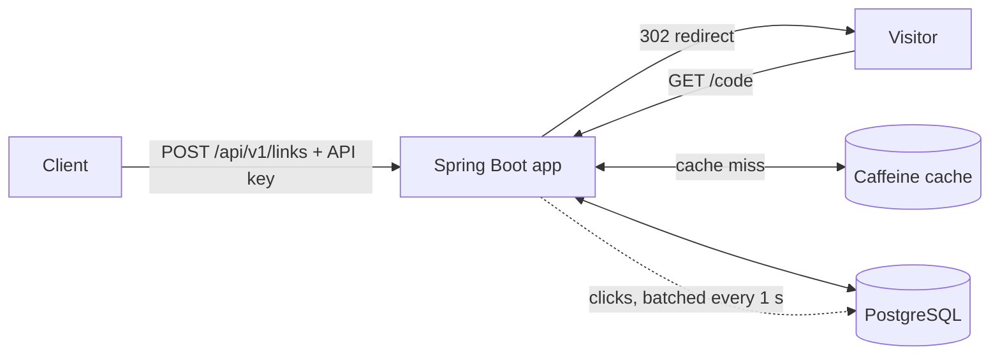

# URL Shortener

[](https://github.com/sanjeevjntu/url-shortener/actions/workflows/ci.yml)


A production-style URL shortener built with Java 25 and Spring Boot 4: short links, fast redirects, click analytics that never slow a redirect, and safe behaviour under failure and abuse.

> **AI-assisted engineering exercise.** AI drafted code and analysis; the engineer decided, verified and owns the result. Every AI interaction and its disposition is in the [AI log](docs/AI-LOG.md).

**Stack:** Java 25 · Spring Boot 4.1 · PostgreSQL 17 · plain JDBC · Caffeine · Bucket4j · Flyway · Testcontainers



---

## What it does

A URL shortener turns a long address such as `https://example.com/some/very/long/path?utm_source=newsletter` into a short one such as `http://localhost:8080/1ZRwY92z`. Anyone who opens the short link is redirected to the original address, and every visit is counted for analytics.

This project builds that service the way it would be built for production: safe under concurrent requests, protected against abuse, observable, and covered by tests on a real database.

### Features

| Feature | How it works |
|---|---|
| 🔗 **Short codes** | 8 random Base58 characters (no look-alikes such as `0 O I l`), about 128 trillion possible codes, unguessable. The database guarantees each code is unique. |
| ⚡ **Fast redirects** | Links are served from an in-memory cache (Caffeine); the database is only asked on a cache miss. Redirects keep working for cached links even if PostgreSQL is down. |
| 📊 **Click analytics** | Total clicks, clicks per day, top referring sites and browsers. Clicks are queued and written in batches every second, so analytics never slow a redirect. No IP addresses are stored. |
| ⏳ **Expiry and delete** | Optional expiry date per link. Expired and deleted links answer `410 Gone`, and a code is never reused, so old printed links can't be hijacked. |
| 🔐 **API keys with permissions** | Creating, deleting and reading stats need an API key with the matching permission (`links:create`, `links:delete`, `stats:read`). Only SHA-256 hashes of keys are stored. |
| 🛡️ **Abuse protection** | Rate limits per API key (create) and per IP (redirect); repeated wrong keys are throttled; links to internal or private addresses are rejected. |
| 🔁 **Safe retries** | An optional `Idempotency-Key` header means a retried create returns the original link instead of a duplicate. |
| 🧾 **Uniform errors** | Every error has the same JSON shape (RFC 9457) with an error code and a trace ID that also appears in the logs. |

### How it works

1. **Create:** a client sends a long URL with its API key. The service checks the key and its permission, validates the URL, draws a random code and stores the link. If the code is already taken, it simply draws again.
2. **Redirect:** a visitor opens the short link. The service looks the code up (cache first, then the database), answers with a `302` redirect, and drops a click event into a queue without waiting.
3. **Analytics:** once per second, the queued clicks are added up per link and day and written to PostgreSQL in a single transaction. Statistics are read back through the stats endpoint.

Full details: [Architecture](docs/ARCHITECTURE.md).

---

## Contents

- [Quick start](#quick-start-docker-only)
- [Reviewer checklist](#reviewer-checklist)
- [Documentation](#documentation)
- [API](#api)
- [Develop](#develop-jdk-25--docker)
- [Production keys and configuration](#production-keys-and-configuration)

---

## Quick start (Docker only)

You need only Docker. No JDK, no setup.

```bash
git clone https://github.com/sanjeevjntu/url-shortener.git
cd url-shortener

# 1. Build and start Postgres + the app (the first build takes a few minutes)
docker compose --profile app up --build -d

# 2. Get this run's API key (empty? wait a few seconds and retry)
docker compose logs app | grep X-API-Key

# 3. Check every endpoint in about 10 seconds
scripts/smoke-test.sh <key>
```

| What | Where |
|---|---|
| Swagger UI | <http://localhost:8080/swagger-ui.html> (click **Authorize**, paste the key) |
| Health and metrics | <http://localhost:8081/actuator> |
| Stop | `docker compose --profile app down` (add `-v` to delete the data) |

> Port 5432, 8080 or 8081 already taken? Change the left-hand port in `docker-compose.yml`.

---

## Reviewer checklist

How each requirement of the assignment brief can be verified.

| Brief asks for | Evidence and how to check it |
|---|---|
| Requirement understanding | [Architecture §1](docs/ARCHITECTURE.md#1-problem-and-assumptions): each ambiguity and how it was resolved |
| Task decomposition | [Engineering summary §1](docs/ENGINEERING-SUMMARY.md#1-plan): tasks T1–T14, each with acceptance criteria |
| Greenfield, brownfield, ambiguous | [Scenarios](docs/SCENARIOS.md). Brownfield proof: migrations V2–V4 are additive, V1 is untouched |
| Defensible decisions | [Decisions](docs/DECISIONS.md) D1–D9, each with the alternatives rejected |
| AI traceability | [AI log](docs/AI-LOG.md): 14 entries. Entries 4, 7, 10 and 14 show AI output rejected or corrected |
| Quality gates | `./gradlew build` runs Spotless, `-Xlint`, SpotBugs, tests and JaCoCo ≥ 80%; CI in `.github/workflows` |
| Testing | Unit tests + Testcontainers ITs on real PostgreSQL ([§3](docs/ENGINEERING-SUMMARY.md#3-testing-approach-and-validation)); `scripts/smoke-test.sh` on the running app |
| Security | In Swagger: `POST` without a key → `401`; `http://169.254.169.254/` → `400`. Scopes → `403` in `ApiKeySecurityIT` |
| Reliability | Redirects survive analytics and DB failures ([§7](docs/ARCHITECTURE.md#7-failure-modes)); `RedirectResilienceIT` |
| Human sign-off | [Sign-off](docs/SIGNOFF.md) S1–S4: signed by the engineer, never by AI |
| Risks and limitations | [Engineering summary §4 and §6](docs/ENGINEERING-SUMMARY.md#4-risks-and-guardrails), with upgrade paths |

---

## Documentation

| Document | What it covers |
|---|---|
| 📐 [Architecture](docs/ARCHITECTURE.md) | **Start here.** Components, request flows, code algorithm, data model, failure modes |
| ⚖️ [Decisions](docs/DECISIONS.md) | D1–D9, each with the alternatives rejected |
| 🧭 [Scenarios](docs/SCENARIOS.md) | Greenfield, brownfield and ambiguous scenarios |
| ✅ [Engineering summary](docs/ENGINEERING-SUMMARY.md) | Plan, quality gates, test results, risks, limitations |
| 🤖 [AI log](docs/AI-LOG.md) | Every AI interaction: accepted, edited or rejected, and why |
| ✍️ [Sign-off](docs/SIGNOFF.md) | Human approval of high-impact changes |

---

## API

| Method | Path | Auth | Responses |
|---|---|---|---|
| `POST` | `/api/v1/links` | key with `links:create` | `201` · `200` replay · `400` · `401` · `403` · `409` · `410` · `429` |
| `GET` | `/{code}` | public | `302` · `404` · `410` · `429` |
| `GET` | `/api/v1/links/{code}` | public | `200` · `400` · `404` · `410` |
| `GET` | `/api/v1/links/{code}/stats?days=30` | key with `stats:read` | `200` · `400` · `401` · `403` · `404` |
| `DELETE` | `/api/v1/links/{code}` | key with `links:delete` | `204` · `401` · `403` · `404` |

- **Create body:** `{"url": "...", "expiresAt": "2027-01-01T00:00:00Z"}` (`expiresAt` optional).
- **Public on purpose:** redirects and link lookups. Whoever clicks a short link has no key.
- **Errors:** always `application/problem+json` with `errorCode`, `timestamp` and `traceId` (also in the `X-Trace-Id` header).
- **Idempotency-Key** (optional header): the client generates a UUID per new link (`uuidgen`) and resends it only when retrying, so a retry returns the original link instead of a duplicate. Same key with a different body → `409`; the link was since deleted or expired → `410`.

```bash
KEY=<the X-API-Key from the log>

# Create (201)
curl -s -X POST localhost:8080/api/v1/links \
  -H "X-API-Key: $KEY" -H "Content-Type: application/json" \
  -H "Idempotency-Key: $(uuidgen)" \
  -d '{"url":"https://spring.io/projects/spring-boot"}'

# Follow the short link (302 to the target)
curl -si localhost:8080/8QKHT6R5

# Click statistics
curl -s localhost:8080/api/v1/links/8QKHT6R5/stats -H "X-API-Key: $KEY"

# Delete (204); the short link then answers 410
curl -si -X DELETE localhost:8080/api/v1/links/8QKHT6R5 -H "X-API-Key: $KEY"
```

---

## Develop (JDK 25 + Docker)

```bash
docker compose up -d postgres     # database only
./gradlew bootRun                 # or the IntelliJ run button on ShortenerApplication
./gradlew spotlessApply build     # format, compile, tests, SpotBugs, coverage ≥ 80%
```

- **API key:** started from the project folder, the app uses the `local` profile and prints a generated key (`X-API-Key: …`) on every start. For a stable key, run `scripts/new-api-key.sh dev --local` once and restart.
- **Production safety:** anywhere else, including the Docker image, the app refuses to start without configured key hashes.
- **Stop:** `Ctrl+C` stops gracefully (queued clicks are flushed).
- **Reports:** `build/reports/` (tests, coverage, SpotBugs). Load test: [load/README.md](load/README.md).

---

## Production keys and configuration

<details>
<summary><b>API keys</b>: only SHA-256 hashes are configured, never the keys</summary>

<br>

Keys are named, scoped (`links:create`, `links:delete`, `stats:read`), optionally expiring, and compared in constant time. Rationale: [decision D6](docs/DECISIONS.md#d6-api-keys-named-scoped-hash-only).

```bash
# Prints the key (give it to the client) and its hash (configure it on the server)
scripts/new-api-key.sh dashboard --scopes stats:read

# Server configuration: the hash only
SHORTENER_APIKEYS_0_NAME=dashboard
SHORTENER_APIKEYS_0_SHA256=<hash>
SHORTENER_APIKEYS_0_SCOPES=stats:read
```

</details>

<details>
<summary><b>Configuration</b>: environment variables</summary>

<br>

- App settings live under `shortener.*` in [`application.yml`](src/main/resources/application.yml): code length, cache TTLs, rate limits, analytics mode. Any of them can be overridden by an environment variable.
- Database: `DB_URL`, `DB_USER`, `DB_PASSWORD`.
- Behind a load balancer: trust forwarded headers from its address range only (example in `application.yml`).

</details>
