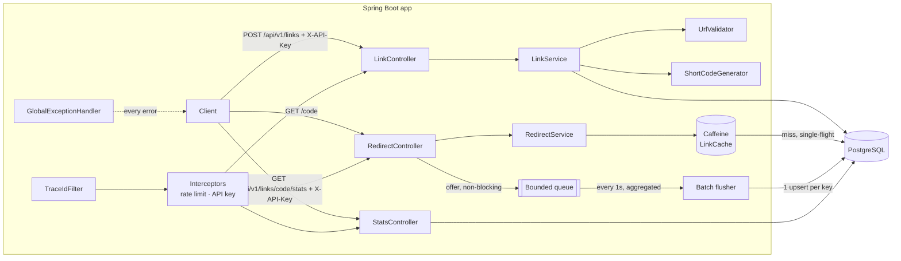
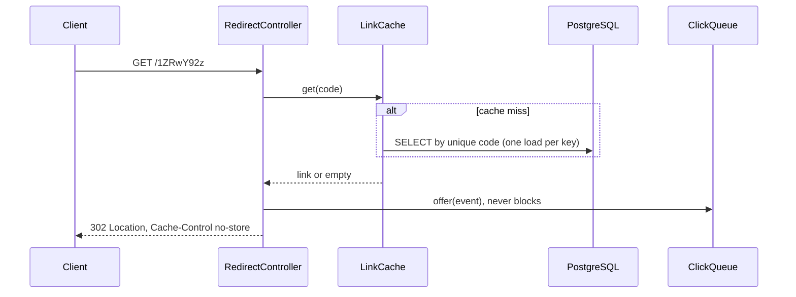

# Architecture

## 1. Problem and assumptions

A production-style URL shortener: create short links, redirect fast, record click analytics **without slowing
redirects**, and degrade safely under failure and abuse.

| Ambiguity in the brief | Resolution |
|---|---|
| Scale | Read-heavy (~100:1), ~1k redirects/s on one node; scalable design, no distributed infrastructure |
| Authentication | Redirects and link lookups are public; creating, deleting and analytics need a scoped API key ([D6](DECISIONS.md)) |
| Same URL twice | A new code each time; `Idempotency-Key` makes retries safe; no custom aliases ([D7](DECISIONS.md)) |
| Expiry | Optional absolute UTC `expiresAt`; expired and deleted links answer `410`; codes are never reused |
| Redirect status | `302`, so every click reaches the service (browsers cache `301`) |
| Analytics | Total clicks, per-day series, top referrer hosts, browser family. No IPs stored |
| Malicious URLs | http/https only, length cap, internal/private/metadata hosts rejected; no reputation API |

## 2. Components



Package by feature: `link`, `redirect` (hot path), `analytics`, `security` (URL guard, rate limits, API keys), `common`
(Base58, errors, trace ID), `config`. Controllers only map HTTP; rules live in services; Base58, the generator, the URL
validator and click aggregation are plain Java, unit-tested without Spring.

## 3. Request flows

**Create** `POST /api/v1/links {url, expiresAt?}` + optional `Idempotency-Key`
1. Authenticate: an API key with `links:create`, else `401`/`403`. Then rate limit **per API key** (burst 10, then
   10/min, else `429` + `Retry-After`), so a key used from many IPs gets no more.
2. Validate and normalise: lowercase host, IDN → ASCII, drop default port and `user:pass@`; keep `%20`, query and
   fragment. Reject localhost, private/link-local/metadata IPs, IPv4-mapped IPv6, numeric tricks (`http://2130706433/`).
3. Idempotency (client UUID, scoped per API key): same body → replay `200`; different body → `409`; link since
   deleted or expired → `410`.
4. `INSERT … ON CONFLICT (code) DO NOTHING RETURNING id`. Code taken → draw again (max 5, metric
   `shortener.code.collisions`), then `503`. The database alone decides uniqueness: no check-then-insert race.
   The client's name is stored as `created_by`.
5. `201 Created` with an absolute `Location`.

**Short code: one random draw, fixed-width Base58**

```java
long n = secureRandom.nextLong(58^8);   // uniform in [0, 128,063,081,718,016)
String code = Base58.encode(n, 8);      // 8 divisions by 58, remainders -> alphabet, padded with '1'
```

`1,234,567,890,123` → remainders `57, 1, 8, 31, 54, 24, 32, 0` → read backwards → **`1ZRwY92z`**. Uniform (unbiased
draw, bijective encoding, tested exhaustively at width 3), unguessable (`SecureRandom`), readable (no `0 O I l`); at 1e9
links a new code collides with probability ~7.8e-6. Upgrade path: a keyed permutation of a sequence, same encoder.

**Redirect** `GET /{code}`



- A sealed `Resolution` (`Redirect | Gone | NotFound`) and an exhaustive `switch` give `302 / 410 / 404`; the compiler
  proves no case is missed. `HEAD` (link checkers, chat previews) gets the `302` but is not counted.
- Caffeine: single-flight loading (no stampede), negative caching of unknown codes (30 s), redirects continue while
  Postgres is down. Expiry is checked on every read. A delete evicts the code; other instances converge within the TTL
  (5 min).

**Analytics.** Redirect → bounded queue (full → drop, counted). Every second the flusher aggregates per (code, day,
dimension): 1,000 clicks on one link become **3 upserts**, sorted to avoid deadlocks, in one transaction. `mode=sync` is
the baseline and rollback switch.

## 4. Cross-cutting

| Concern | Implementation |
|---|---|
| Errors | One `@RestControllerAdvice`: **every** error is RFC 9457 `problem+json` with `errorCode`, `timestamp`, `traceId`; validation adds `errors[]`; bugs get a generic `500` |
| Tracing | `X-Trace-Id` (incoming or generated) in every log line, the response header and error bodies |
| Auth | Hash-only, named keys with scopes `links:create`, `links:delete`, `stats:read`; optional expiry; constant-time compare; failures logged, counted, throttled; caller stored in `created_by` / `deleted_by`; no key → startup fails, except `local`, which generates one per run ([D6](DECISIONS.md)) |
| Rate limits | Bucket4j bucket per (policy, client) in a bounded Caffeine map: per API key for creates, per IP (IPv4, IPv6 /64) for redirects and failed auth; `X-RateLimit-Remaining`; `X-Forwarded-For` only from a trusted proxy ([D8](DECISIONS.md)) |
| Lifecycle | Lazy expiry (no background job); soft delete, so `UNIQUE(code)` never reissues a code; hourly purge of idempotency keys older than 24 h |
| Observability | Actuator on **port 8081**, off the public load balancer: health, probes, Prometheus (cache hit ratio, collisions, drops, `429`s, auth failures) |
| Contract | springdoc: `/swagger-ui.html`, `/v3/api-docs`, errors documented per endpoint |

## 5. Data model (Flyway V1–V4)

| Table | Key points |
|---|---|
| `links` | `bigint identity` PK; `UNIQUE(code)`; CHECKs on code format, status, `expires_at > created_at`; audit `created_by`; soft delete (`deleted_at`, `deleted_by`) |
| `idempotency_keys` | PK `(scope_hash, idem_key)`; SHA-256 digests as `bytea`; index on `created_at` for the purge |
| `link_click_stats` | PK `(code, dimension, day, value)` = the read pattern; `fillfactor 90` for in-place counter updates; no FK |

## 6. Java 25 and Spring Boot 4 features used

Virtual threads (blocking JDBC; the Hikari pool is the explicit limit); records, sealed interfaces, record patterns,
unnamed `_`; flexible constructor bodies (`RateLimitedException` computes `Retry-After` before `super`); `///` Markdown
doc comments; `InetAddress.ofLiteral` (no DNS); AOT cache in the Dockerfile. Spring 7 / Boot 4: `JdbcClient`, built-in
method validation, `ProblemDetail`, modular test starters, `@ServiceConnection`, validated `@ConfigurationProperties`
records.

## 7. Failure modes

| Failure | Behaviour |
|---|---|
| Analytics write fails or is slow | Redirect unaffected; drops and failures counted |
| Postgres down | Cached codes keep redirecting; others fail fast (1.5 s pool timeout) with `503` |
| Viral link, cold cache | One DB load (single-flight); everyone else waits for it |
| Code scanning | Negative cache absorbs repeats; the redirect bucket limits volume |
| Bug | `500` with a generic message and `traceId`; the stack trace only in the log |
